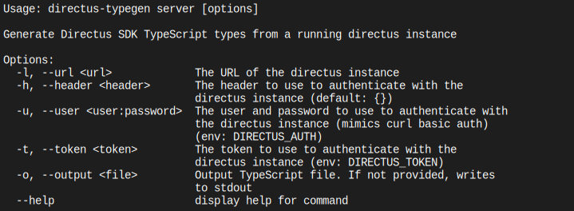

# Directus TypeGen CLI

## Usage

```shell
npx @ikerin/directus-typegen-cli generate --input snapshot.yaml --output src/directus-schema.ts
```

You can also install the script with its dependencies locally to run it with your package manager of choice:

```shell
# With yarn
yarn add --dev @ikerin/directus-typegen-cli
yarn directus-typegen-cli snapshot --input snapshot.yaml --output src/directus-schema.ts

# With bun
bun add --dev @ikerin/directus-typegen-cli
bun run directus-typegen-cli snapshot --input snapshot.yaml --output src/directus-schema.ts
```

You can utilize both stdin and stdout if this needs to be a part of a pipeline

```shell
cat snapshot.yaml | bun run directus-typegen-cli snapshot | bun run prettier --stdin-filepath directus-schema.ts > src/directus-schema.ts
```

You can also query a live server to get your types, which will take into account the user's permissions.

```shell
yarn directus-typegen-cli server --url http://localhost:8055 --user 'admin@example.com:admin-password' --output src/directus-schema.ts
```

## Full details

Snapshot command


Server command


## Development

Install dependencies

```shell
bun install
```

Run the tests

```shell
bun test
```

To rebuild the docs/help.svg file you will need [ansisvg](https://github.com/wader/ansisvg)

```shell
bun run directus-typegen snapshot --help | ansisvg --colorscheme 'Apple System Colors' --charboxsize 9x16 --marginsize=4x4 > docs/snapshot.svg

bun run directus-typegen server --help | ansisvg --colorscheme 'Apple System Colors' --charboxsize 9x16 --marginsize=4x4 > docs/server.svg
```
