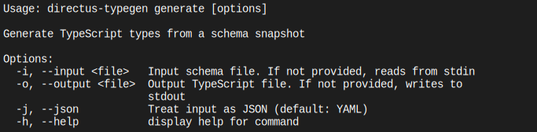

# Directus TypeGen CLI

## Usage

```console
npx @ikerin/directus-typegen-cli generate --input snapshot.yaml --output src/directus-schema.ts
```

You can also install the script with its dependencies locally to run it with your package manager of choice:

```console
# With yarn
yarn add --dev @ikerin/directus-typegen-cli
yarn directus-typegen-cli generate --input snapshot.yaml --output src/directus-schema.ts

# With bun
bun add --dev @ikerin/directus-typegen-cli
bun run directus-typegen-cli generate --input snapshot.yaml --output src/directus-schema.ts
```

You can utilize both stdin and stdout if this needs to be a part of a pipeline

```console
cat snapshot.yaml | bun run directus-typegen-cli generate | bun run prettier --stdin-filepath directus-schema.ts > src/directus-schema.ts
```

## Full details



## Development

Install dependencies

```console
bun install
```

Run the tests

```console
bun test
```

To rebuild the docs/help.svg file you will need [ansisvg](https://github.com/wader/ansisvg)

```console
bun run directus-typegen generate --help | ansisvg --colorscheme 'Apple System Colors' --charboxsize 9x16 --marginsize=4x4 > docs/help.svg
```
