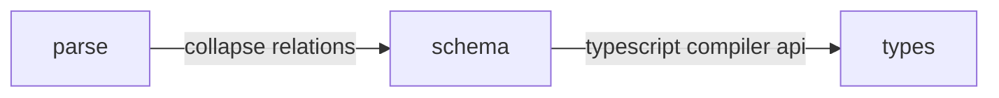

# Directus TypeGen

Generate typescript types for [Directus SDK](https://docs.directus.io/guides/sdk/types.html)

## Example Usage

> [examples/simple.ts](examples/simple.ts)

```typescript
import { generateTypesFromSnapshot } from '@ikerin/directus-typegen';
import { readFileSync } from 'fs';
import { join } from 'path';

// Get the contents of the snapshot
// We are using JSON for simplicity, usually you will use YAML
const snapshotPath = join(import.meta.dirname, 'snapshot.json');
const snapshot = JSON.parse(readFileSync(snapshotPath, 'utf-8'));

// This is the core of the operation
const types = generateTypesFromSnapshot(snapshot);

console.log(types);
```

## Design

The package splits the work into 2 stages, first it reads the snapshot and generates an intermediate schema, that is later used to convert it to the typescript types.

This way we can keep the parsing / processing / type generation as separate steps



Typegen validates the directus snapshot using its own schema, its a subset of a valid directus snapshot, but fields that are not used are not required (hopefully helping with forward compatibility)

> [examples/validate.ts:(generate)](examples/validate.ts#L7-L12)

```typescript
const validSnapshot = toDirectusSnapshot(snapshot);

console.log(validSnapshot);
```

You can inspect the intermediate step using `toSchema`

> [examples/schema.ts:(generate)](examples/schema.ts#L7-L12)

```typescript
const intermediateSchema = toSchema(snapshot);

console.log(intermediateSchema);
```

## Development

To start development, install the dependencies

```shell
bun install
```

To test run the bun tests

```shell
bun test
```

Build the package so that its compiled content is available to directus-typegen-cli

```shell
bun run build
```

If you modify the examples folder, you can run this script to update the README.md references

```shell
bun run build:readme
```

## Deployment

Deployment is done via the CI/CD (Github Actions) a new version would be published when a version is bumped
